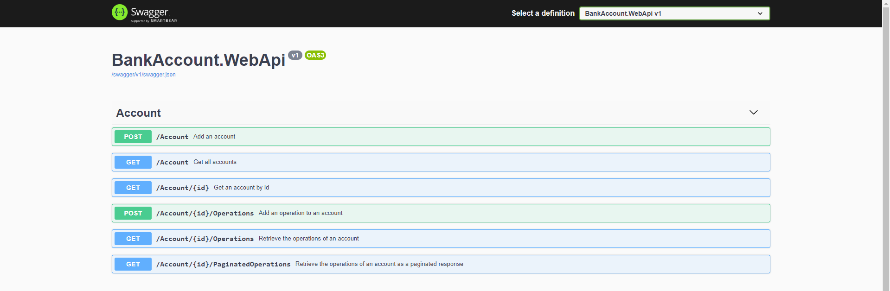

# BankAccountKata
Kata link : https://gitlab.com/exalt-it-dojo/katas-c-sharp/-/tree/main/BankAccount

# API preview : 

This api allows you to add an account with initial balance value and do deposit/withdrawal operations on the accounts.

Please find below a screenshot from the Swagger UI :

All you need to run this solution is .NET 6 SDK and Visual Studio 2022.

# Possible evolutions (out of kata user stories)

## Basic :

### User stories (Agent add account - Customer authenticate)

- Account registration (by agent)
- Account authentication (jwt + http only cookie)
- Role based authorization (agent+customer)

## Advanced : 

### Microservices : 

- Account service : allows user CRUD + push events to an event bus. 
- Auth service : responsible of api auth
- Operation service : allows operations CRUD + push events to an events bus.
- Emailing service : send emails according to the events pushed into the events bus. 

## Quality assurance 

- Addition of unit tests
- Use of BDD

Keywords : Clean architecture, CQRS, TDD, Integration tests, C# .NET, XUnit, Entity framework

